# ReadSphere - eBook Reader (Storage Specific)

Experience the ultimate reading journey with the ReadSphere App! Our feature-packed app brings you a
seamless reading experience with a multitude of customization options. Explore your own collection
of eBooks with the following exceptional features:

## **Features** 

📚 **Local eBook Library**:

- Access and read eBooks stored on your device without an internet connection. No need to rely on
  external sources.

🔍 **Built-in Web Browser Support**:

- Access your favorite online sources and seamlessly integrate web content into your reading
  experience.

📌 **Save Your Progress**:

- Never lose your place in a book again. The app remembers where you left off and allows you to
  easily scroll to a specific part of the book.

📖 **Effortless Paging with Scrolling**:

- Enjoy a beautifully formatted EPUB reading experience with our intuitive paging and scrolling
  feature.

🔎 **Search Within Books**:

- Quickly find specific words or sentences within the entire book, enhancing your research and
  reading efficiency.

📚 **Effortless Navigation**:

- Navigate between pages with ease using the book content list or seek bar. Keep track of your
  reading progress with the current page name and percentage displayed in the seek bar.

📋 **Text Management**:

- Copy and share text from books seamlessly with just a few taps.

🎨 **Customize Your Reading Experience**:

- Tailor your book's appearance to your preferences with a variety of visual options, including:
    - Change Background/Theme Color (White, Black, Grey)
    - Adjust Brightness (Low to High) using the seek bar
    - Modify Font Size with the seek bar
    - Select Font Family (sans serif, serif, monospace, cursive, or default)
    - Choose from Different Reading Options (scroll and swipe)
    - Enable Automatic Scrolling with Speed Control via the seek bar
    - Lock Screen Rotation for a consistent reading experience
    - Customize Book Browsing with options like line spacing, word spacing, and side margins

🔒 **Secure Your Books**:

- Ensure your books are for your eyes only with the Lock Book feature, providing secure access to
  your reading collection.

🖋️ **Highlight and Save Quotes**:

- Capture your favorite quotes and sentences from books effortlessly and save them in dedicated .txt
  files, one for each book, conveniently stored in your phone memory.

🗑️ **Manage Quote Files**:

- Easily delete unnecessary text files containing quotes when they are no longer needed, keeping
  your library organized and clutter-free.

Embark on a captivating reading adventure with the BookReader App. Explore books, enhance your
reading experience, and make every page your own with our rich feature set. Download now and
transform the way you read!

## **Prerequisites** 

Before using the app, make sure you have the following:

1. **Storage Access**:
    - Grant the manage external storage permission to access your device's storage to access and
      read eBooks stored locally.

## **Setup** 

Follow these steps to set up the BookReader App:

1. **Clone the Repository**:
    - Clone the repository
      from [GitHub](https://gitlab.com/priyanka.makwana/ebookhaven-storagespecific).

2. **Open in Android Studio**:
    - Open the project in Android Studio.

3. **Build and Run**:
    - Build and run the app on an Android emulator or device.

## **Usage** 

1. **Home Screen**:
    - The home screen has a bottom navigation bar with options for Recent, Library, and Settings.
    - Recent: Displays recently read eBooks.
    - Library: Shows all eBooks available on the device.
    - Settings: Contains lists of sources from where you can download eBooks.

2. **Reading an eBook**:
    - Tap on an eBook from the Recent or Library screen to start reading it. This will open the
      eBook in the Book Reader Activity with all the features mentioned above.

3. **Book Reader Activity**:
    - After downloading a book, you can read it in the Book Reader Activity.
    - Customize your reading experience with various options such as changing background/theme
      color, adjusting brightness, modifying font size, etc.

## **Dependencies** 

Manager External Storage permission is Required.

## **Notes** 

This app is designed to provide a seamless reading experience with locally stored eBooks. To access
and read eBooks from your device, make sure to grant the app permission to manage external storage.

Ensure that you grant the app the necessary permission to access your device's storage to view and
read eBooks stored locally.

Feel free to reach out with any feedback or suggestions. Happy reading!

## **Download Apk** 

Download Apk
from [Here](APK/ReadSphere_1.0_07_02.apk)

## Screenshots

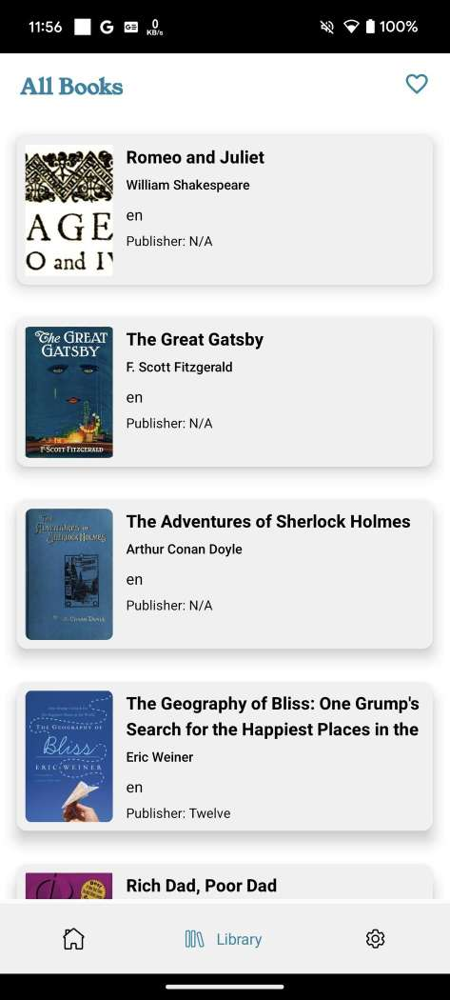
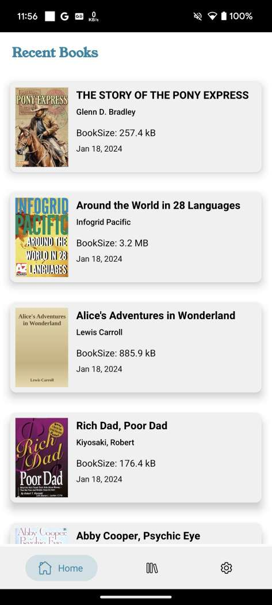
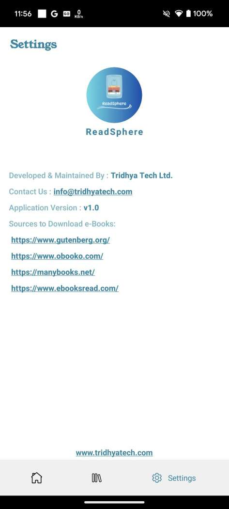
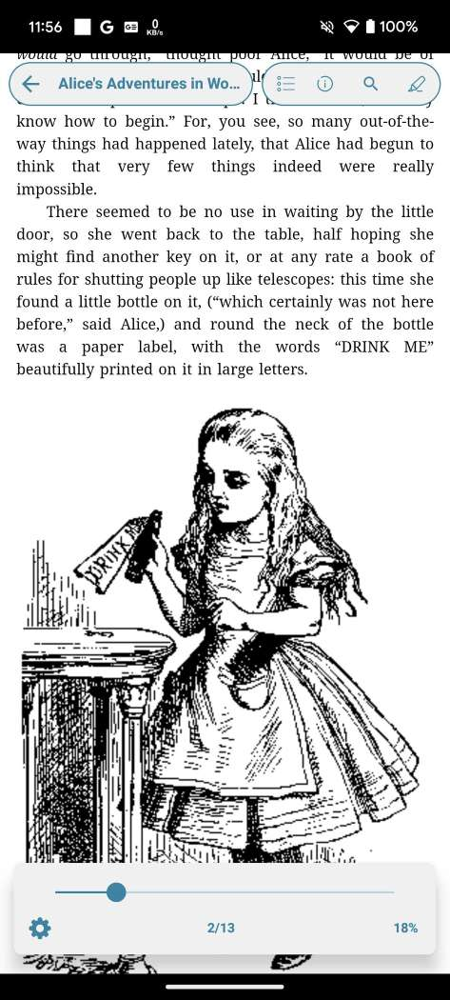
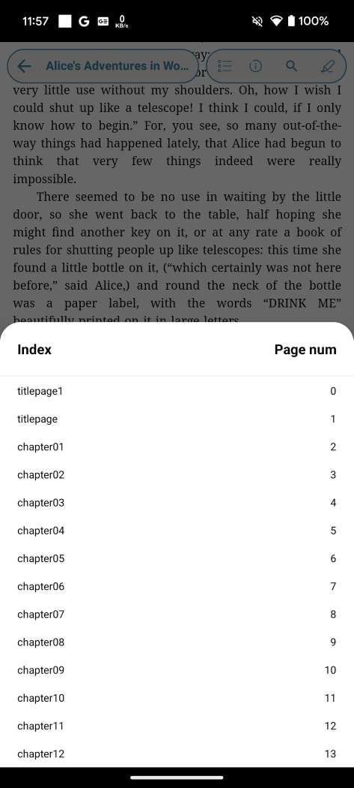
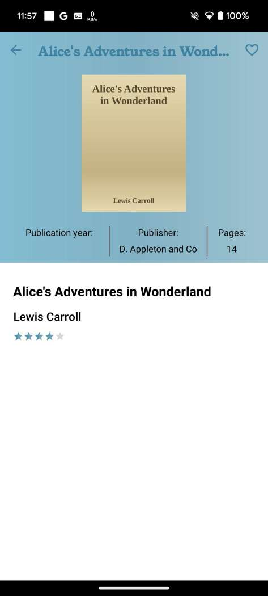
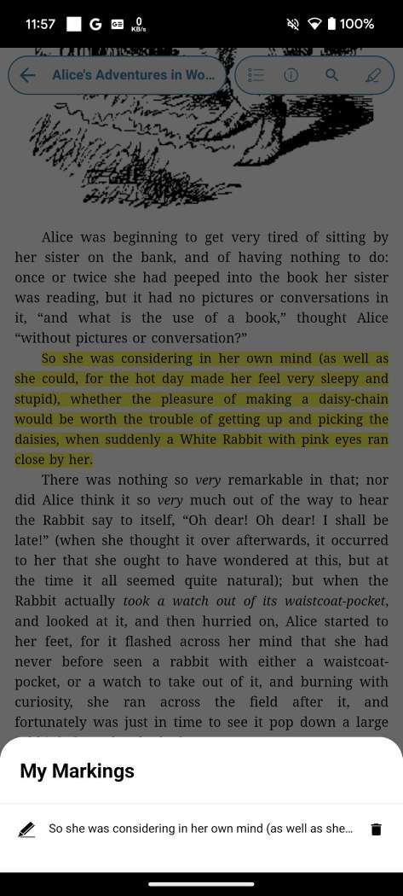
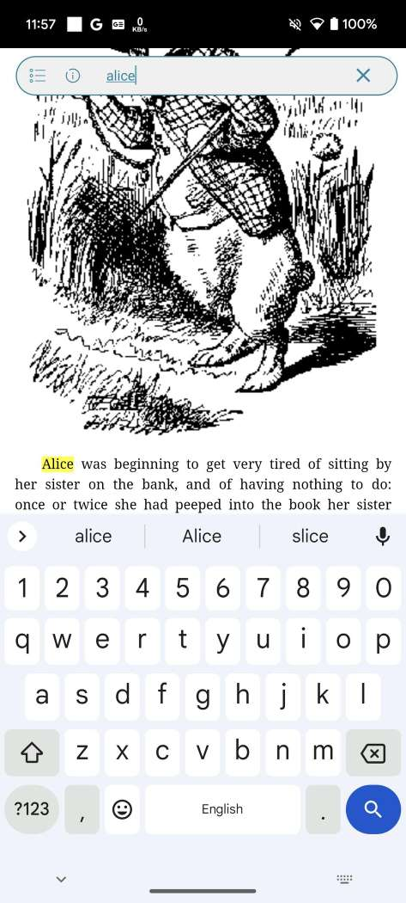
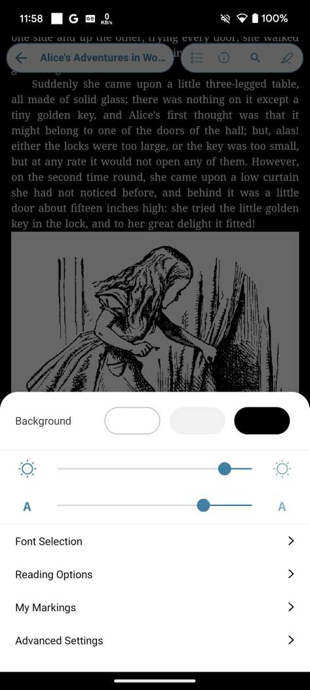
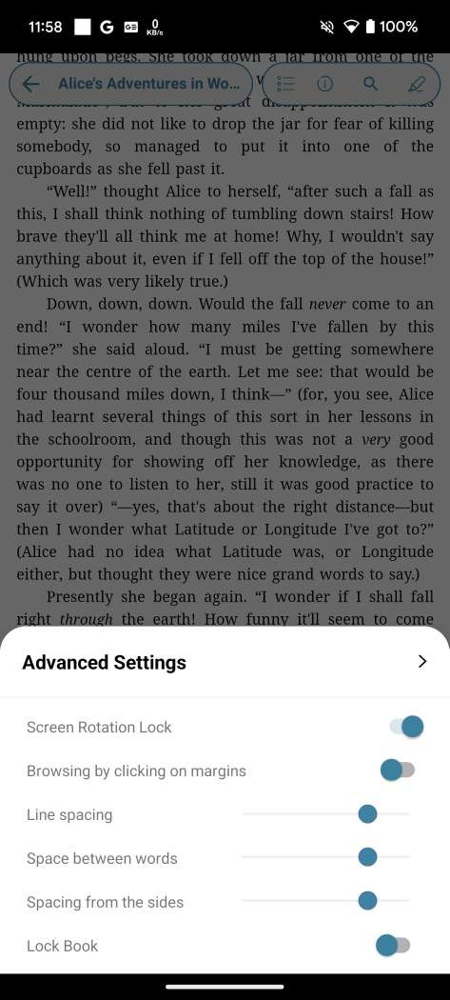
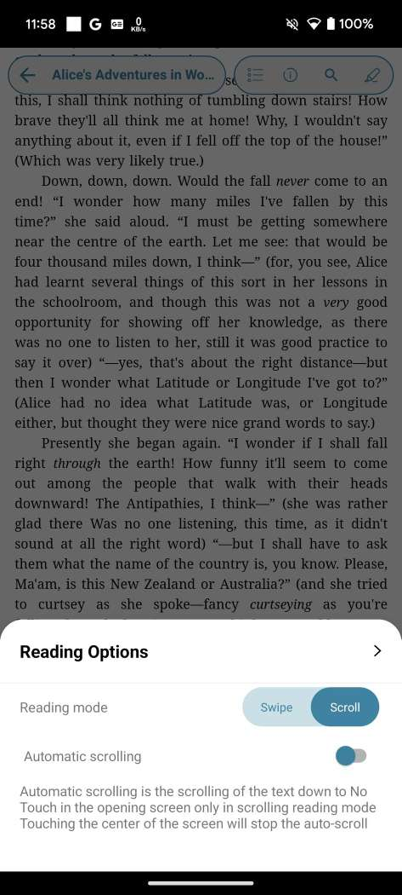
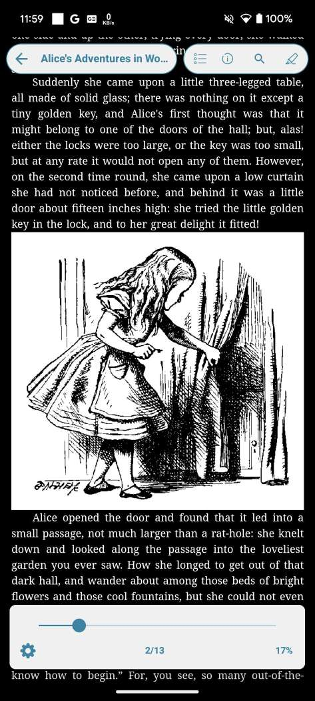

